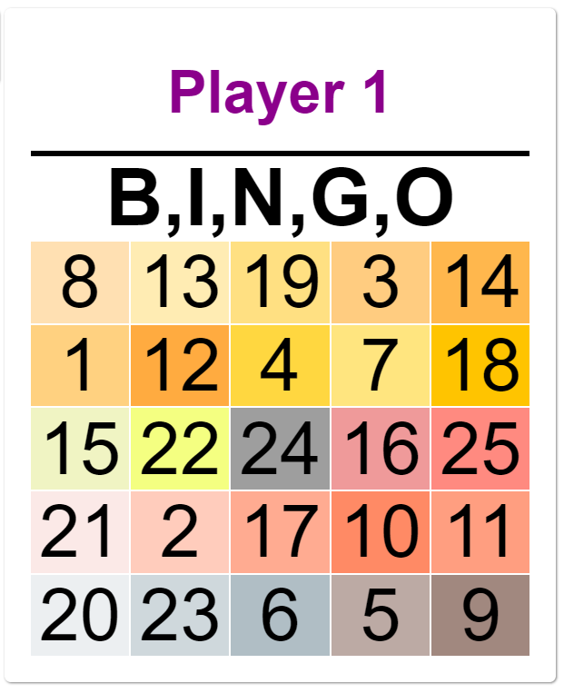
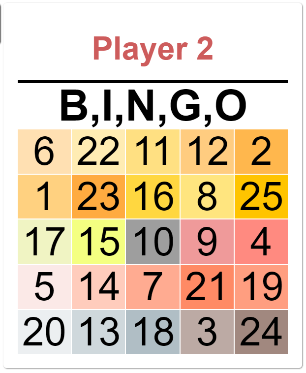
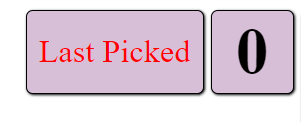
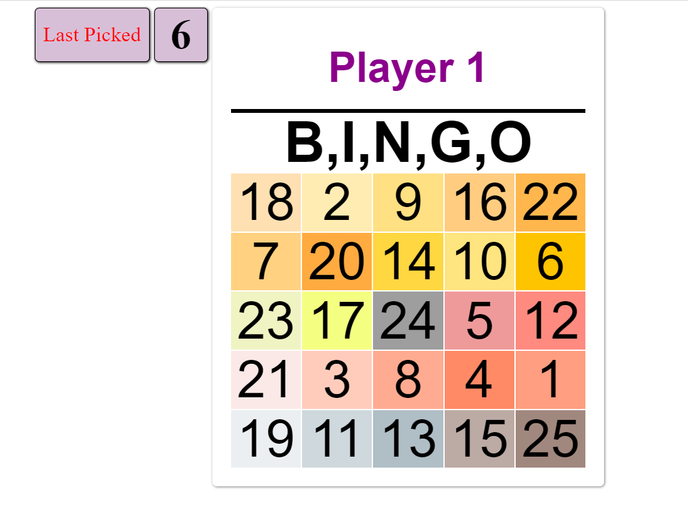
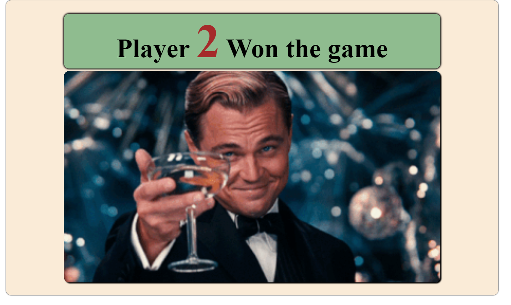

# Bingo

This Project based on the famous BINGO Game,
where each player should pick a number from 25 numbers, and by that his turn ends and the other player should pick the last picked number by player 1 as first as player 2 and then he chooses another number and by that the player 2 ends his turn, and player 1 should do the same and so on.

